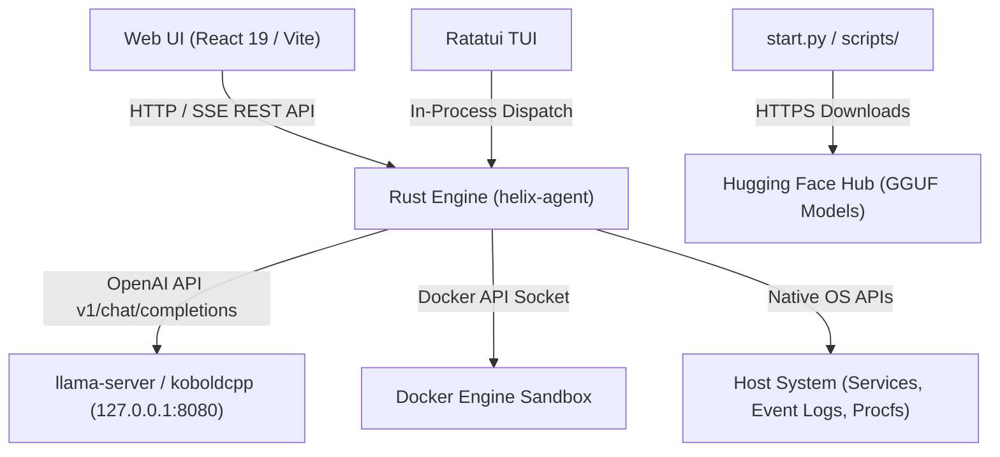

# External Integrations

**Last Updated:** 2026-07-24

## System & Network Integration Points

## Integration Details

### 1. Local LLM Server Interface (`llama-server` / `koboldcpp`)
- **Protocol:** HTTP / REST (OpenAI Chat Completions API)
- **Endpoint:** `http://127.0.0.1:8080/v1/chat/completions`
- **Discovery Endpoint:** `http://127.0.0.1:8080/v1/models`
- **Payload Format:** JSON formatted with standard OpenAI parameters (`messages`, `temperature`, `tools`, `grammar`/`gbnf`)
- **Implementation File:** [agent-rs/src/agent_core/tool_runtime.rs](file:///home/omprakash/helix-cli/agent-rs/src/agent_core/tool_runtime.rs) & [scripts/start_server.py](file:///home/omprakash/helix-cli/scripts/start_server.py)

### 2. Internal Web UI / REST & Event API
- **Protocol:** HTTP REST & SSE (Server-Sent Events)
- **Port:** Local port 3001 (configurable via environment)
- **Interface:** Exposes status check, user chat message input, human approval decisions (allow/deny tool execution), and execution logs.
- **Implementation File:** [agent-rs/src/server.rs](file:///home/omprakash/helix-cli/agent-rs/src/server.rs) & [agent-rs/src/tui/api.rs](file:///home/omprakash/helix-cli/agent-rs/src/tui/api.rs)

### 3. Docker Container Sandbox Integration
- **Protocol:** Docker Engine Daemon API via Unix Socket (`/var/run/docker.sock`) or Windows Named Pipe (`\\.\pipe\docker_engine`)
- **Library:** `bollard` 0.20
- **Purpose:** Executes high-risk command repairs or diagnostic tasks in isolated container runtimes when security sandbox policy is set to containerized mode.
- **Implementation File:** [agent-rs/src/security/sandbox.rs](file:///home/omprakash/helix-cli/agent-rs/src/security/sandbox.rs)

### 4. Host OS System Diagnostic APIs
- **Windows Integration:** `windows-service` and `evtx` for native Windows Event Log parsing (`.evtx` files) and service query control.
- **Linux Integration:** Systemd unit status, journal log parsing, process tree analysis via `/proc` and `sysinfo`.
- **Implementation Files:** [agent-rs/src/agent_core/diagnostics/system.rs](file:///home/omprakash/helix-cli/agent-rs/src/agent_core/diagnostics/system.rs) & [agent-rs/src/agent_core/diagnostics/logs.rs](file:///home/omprakash/helix-cli/agent-rs/src/agent_core/diagnostics/logs.rs)

### 5. Remote Model Repositories (Hugging Face Hub)
- **Protocol:** HTTPS GET requests
- **Purpose:** Fetching GGUF model binaries during onboarding or via model install commands.
- **Implementation File:** [scripts/download_model.py](file:///home/omprakash/helix-cli/scripts/download_model.py)
